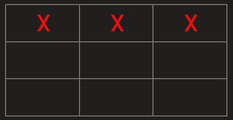
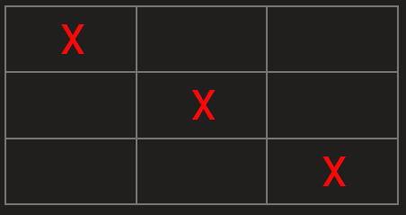

# Tic-Tac-Toe
Grab a friend and play a classic game of 1v1 Tic Tac Toe in your own web browser. [Play Here](https://zach39908.github.io/Tic-Tac-Toe/)

## How to Play
Tic Tac Toe consists of a 3x3 square grid as the gameboard. Each player is assigned a unique token/piece which they can play on any open square on the board when it is their turn. The winner is the first player which can connect 3 of their pieces either in any row, any column, or diagonally across the board.  

Remember to press the "Start/Restart Game" button before playing a new round. This will prompt for each player's name and token/piece. If you are in the middle of a round, this button will reset the entire board.

## About this Game
This game was developed in Vanilla JavaScript/HTML/CSS utilizing concepts of the revealing module pattern. Development guidelines were based on instructions from [The Odin Project](https://www.theodinproject.com/lessons/node-path-javascript-tic-tac-toe).